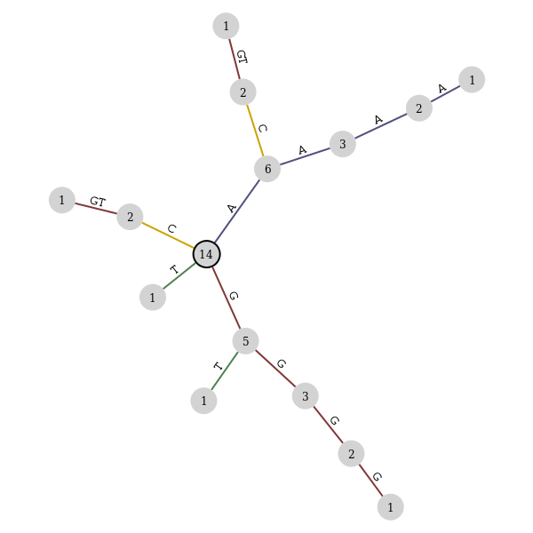
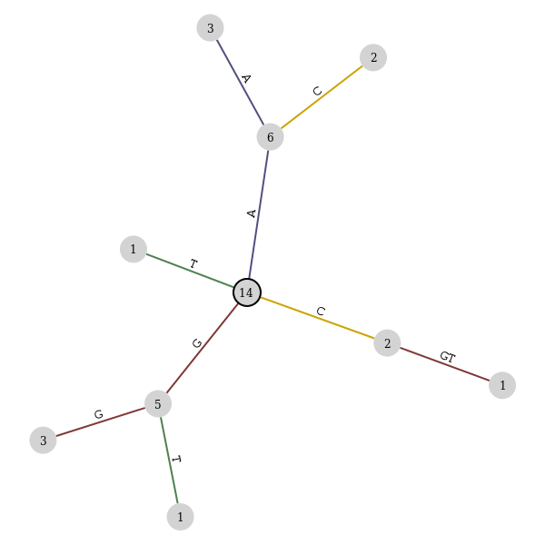
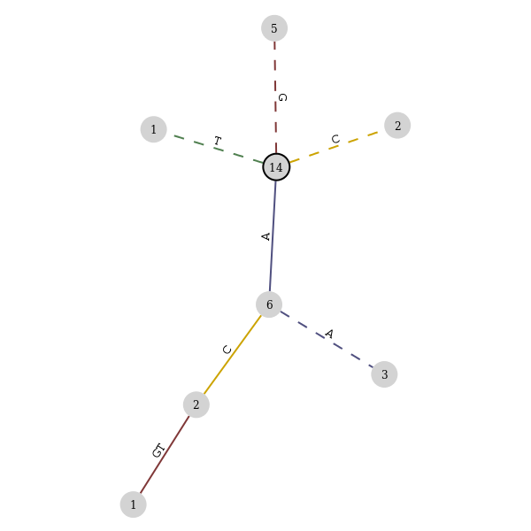

Input/Output
============

.. testsetup:: *

   import seqan
   import seqan.io.graphtool
   import graph_tool.draw

The graph-tool package
----------------------

If you have the graph-tool_ package installed, you can use it to create graphs
that represent suffix trees or arrays. The graphs can be saved to various
output formats or examined interactively. For example, suppose we have an index

.. _graph-tool: http://graph-tool.skewed.de/

..  doctest::

    >>> seqs = seqan.StringDNASet(('ACGT', 'AAAA', 'GGGG', 'AC'))
    >>> index = seqan.IndexStringDNASetESA(seqs)

We can build a graphtool graph from the index

..  doctest::

    >>> builder = seqan.io.graphtool.Builder(index)

and save it as a figure using a scale force directed placement (SFDP) layout algorithm

..  doctest::

    >>> pos = graph_tool.draw.graph_draw(
    ...     builder.graph,
    ...     pos=graph_tool.draw.sfdp_layout(builder.graph),
    ...     vertex_size=30,
    ...     vertex_fill_color="lightgrey",
    ...     vertex_text=builder.occurrences,
    ...     vertex_pen_width=seqan.io.graphtool.root_vertex_property(builder),
    ...     edge_text=seqan.io.graphtool.edge_labels_for_output(builder),
    ...     edge_color=seqan.io.graphtool.color_edges_by_first_symbol(builder),
    ...     edge_end_marker="none",
    ...     edge_pen_width=2,
    ...     output="index.png"
    ... )

Here we have set various edge and vertex properties such that:

- The root vertex has a thicker border
- The edges are colored by their first base
- The number of occurrences for each vertex are shown

We could have used predicates to control which parts of the suffix we built a graph for.
A depthpredicate only shows those vertices within a certain distance of the root vertex

..  doctest::

    >>> builder = seqan.io.graphtool.Builder(index, predicate=seqan.depthpredicate(2))
    >>> pos = graph_tool.draw.graph_draw(
    ...     builder.graph,
    ...     pos=graph_tool.draw.sfdp_layout(builder.graph),
    ...     vertex_size=30,
    ...     vertex_fill_color="lightgrey",
    ...     vertex_text=builder.occurrences,
    ...     vertex_pen_width=seqan.io.graphtool.root_vertex_property(builder),
    ...     edge_text=seqan.io.graphtool.edge_labels_for_output(builder),
    ...     edge_color=seqan.io.graphtool.color_edges_by_first_symbol(builder),
    ...     edge_end_marker="none",
    ...     edge_pen_width=2,
    ...     output="maxdepth-2.png"
    ... )

or a suffix predicate only shows those vertices and edges near a given suffix

..  doctest::

    >>> suffix = 'ACG'
    >>> builder = seqan.io.graphtool.Builder(index, predicate=seqan.suffixpredicate(suffix))
    >>> pos = graph_tool.draw.graph_draw(
    ...     builder.graph,
    ...     pos=graph_tool.draw.sfdp_layout(builder.graph),
    ...     vertex_size=30,
    ...     vertex_fill_color="lightgrey",
    ...     vertex_text=builder.occurrences,
    ...     vertex_pen_width=seqan.io.graphtool.root_vertex_property(builder),
    ...     edge_text=seqan.io.graphtool.edge_labels_for_output(builder),
    ...     edge_color=seqan.io.graphtool.color_edges_by_first_symbol(builder),
    ...     edge_end_marker="none",
    ...     edge_pen_width=2,
    ...     edge_dash_style=seqan.io.graphtool.dash_non_suffix_edges(builder, suffix),
    ...     output="suffix.png"
    ... )

